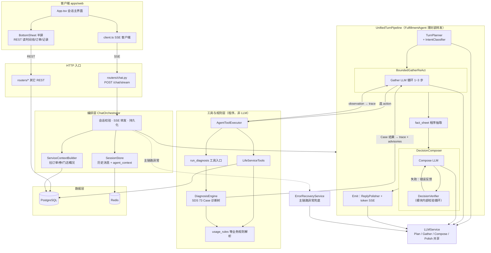
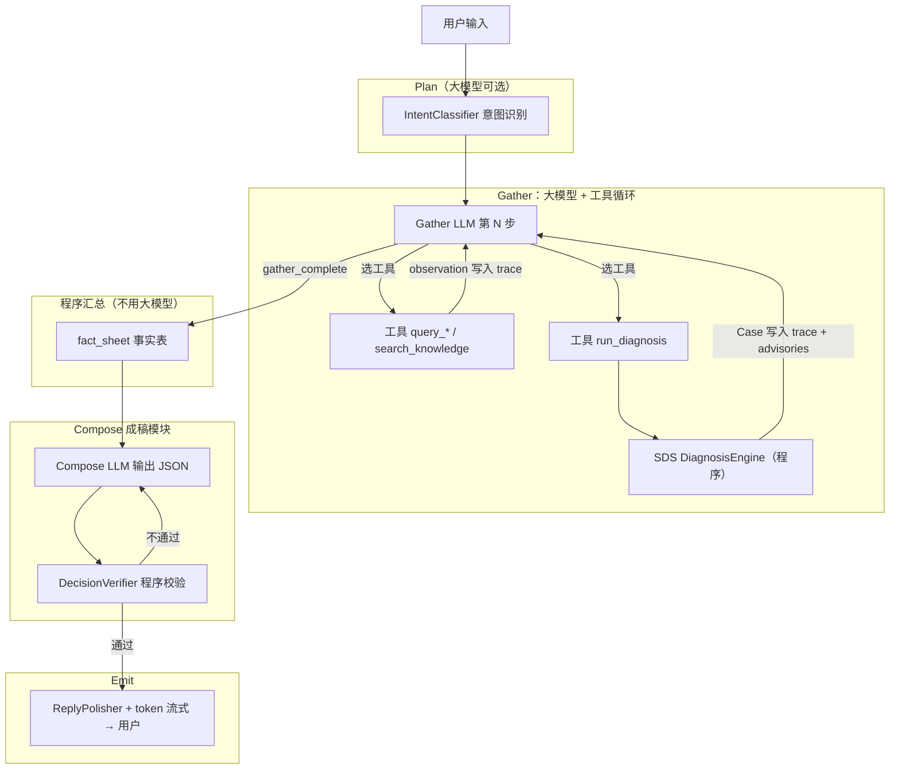
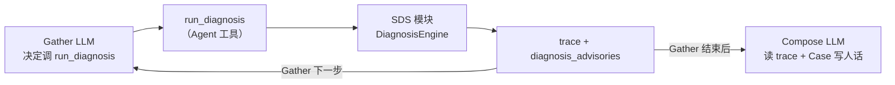
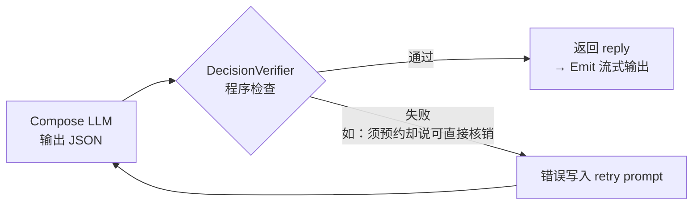
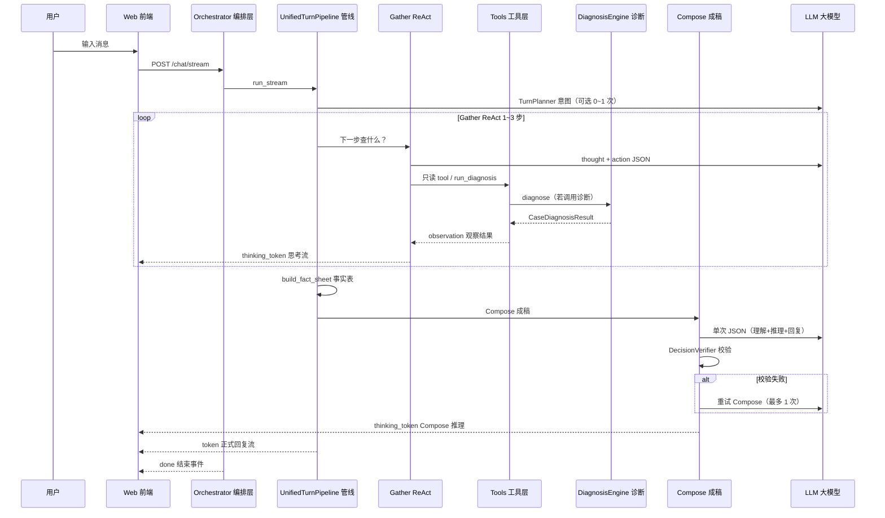

# 系统架构详解

AI 履约服务管家的技术分层、关键模块与数据流。本文档与源码对齐，术语采用 **「中文名（EnglishName）」** 格式，便于阅读与检索。

> **主链路**：`TurnPlanner` → `BoundedGatherReAct` → `fact_sheet` → `DecisionComposer`（内含 `DecisionVerifier`）→ `Emit`  
> **入口文件**：`apps/api/app/services/unified_turn_pipeline.py`  
> 旧版多轮 ReAct Agent 已移除；`fulfillment_agent.py` 仅为 Pipeline 薄封装。

---

## 1. 设计目标

| 目标 | 实现方式 |
|------|----------|
| 帮用户**完成履约** | 会话 + 只读工具核实 + 写操作办理 + 可执行建议 |
| 诊断**可解释** | SDS 诊断树读 DB 事实 + 规则推导 Case，思考区展示推理过程 |
| Demo **长期可玩** | 相对时间 seed + 启动时 mock 时间对齐到当前 |
| 体验**专业友好** | 思考区中文化；内部 Case/Intent 编号不暴露给用户 |
| **成本可控** | 每轮 2~4 次 LLM；Gather 有界 3 步；Compose 单次成稿 |

---

## 2. 总体架构

### 2.1 分层图（按代码实现）

下图反映 **真实调用关系**：`DecisionVerifier` 嵌在 `DecisionComposer` 内部；SDS 由 `run_diagnosis` 工具触发；Gather 工具 observation **回写**下一轮 Gather LLM；`ServiceContextBuilder` 在 Orchestrator 中先于 Pipeline 执行。



**各层中文说明**（与上图中模块一一对应）：

| 模块 | 中文职责 | 代码位置 |
|------|----------|----------|
| **ChatOrchestrator** | 校验用户；**先**拉 service-context；转发 Pipeline 事件为 SSE；写对话与 Redis 跨轮记忆 | `orchestrator.py` |
| **FulfillmentAgent** | 类名兼容层，100% 转发 `UnifiedTurnPipeline.run_stream` | `fulfillment_agent.py` |
| **TurnPlanner** | 意图 + 接话模式 + task_type；不硬编码 Gather 工具 | `turn_plan.py` + `intent.py` |
| **BoundedGatherReAct** | 有界 ReAct：LLM 选工具/规则，observation **回到下一步 LLM** | `gather_react.py` |
| **AgentToolExecutor** | 执行 `query_*` / `run_diagnosis` 等；写操作在 Gather 阶段 gate | `agent_tools.py` |
| **run_diagnosis → SDS** | 工具触发诊断引擎；SDS 是**独立程序模块**，不是 LLM | `agent_tools.py` → `diagnosis/engine.py` |
| **usage_rules** | 从券面文案/门店/当前时间程序推导预约、时段等约束 | `usage_rules.py` |
| **fact_sheet** | Gather 结束后程序汇总查库 + 规则 + Case 标签；**独立模块，非 SDS**；供 Compose / Verify / Redis | `fact_sheet.py` |
| **DecisionComposer** | 唯一成稿 LLM；prompt 含完整 Gather trace + fact_sheet + 诊断结论 | `decision_composer.py` |
| **DecisionVerifier** | **嵌在 Composer 内部**：检查 Compose JSON，失败则 **同一 LLM 重写** | `decision_verifier.py` |
| **Emit / ReplyPolisher** | Verify 通过后流式输出 reply（可选二次润色） | `unified_turn_pipeline.py` + `reply_polisher.py` |
| **ErrorRecoveryService** | 主链路崩溃时的兜底回复（旁路，非每轮必经） | `error_recovery.py` |

**与旧版分层图的修正点**：

| 旧图问题 | 实际实现 |
|----------|----------|
| Verify 与 Compose 并列 | Verify 在 `DecisionComposer.compose()` 的 **while 循环内** |
| SDS 与 Tools 平级直连 | SDS 仅在被 **`run_diagnosis` 工具** 调用时运行 |
| Gather 单向指向 Tools | Tools 的 observation **回写** Gather 下一步 prompt |
| Sheet 直连 PostgreSQL | 半屏走 **REST API**（如 `/fulfillment-timeline`） |
| LLM 挂在 Compose 后面 | `LLMService` 被 Plan / Gather / Compose / Polish **共享** |

### 2.2 核心数据流图解

本节说明 **SDS、规则、Case、大模型** 的分工，以及数据何时回到 LLM。详见下文「谁输出给谁」对照表。

#### 2.2.1 一轮对话总流程（纠正版）



**读图要点**：

- **Verify 不在 Compose 外面**，而是成稿模块内部的「写完 → 质检 → 不合格重写」。
- **SDS 结果必回 LLM**：Gather 下一步 prompt 含上一步 observation；Gather 结束后 Compose prompt 含完整 trace + 诊断块。
- **fact_sheet** 是 Gather + 工具查库 + 规则程序 + SDS Case 标签的程序汇总；**不含** Gather LLM 的 thought。

#### 2.2.2 SDS / run_diagnosis / 大模型关系



| 概念 | 类型 | 说明 |
|------|------|------|
| **SDS** | 独立程序模块 | 73 Case 注册表 + 诊断树；同样输入同样输出 |
| **run_diagnosis** | Agent 工具名 | Gather 阶段「申请跑一次 SDS」的入口 |
| **Case** | SDS 输出 | 如 PC-010；写入 trace / fact_sheet，**不直接展示给用户** |
| **Rules** | 程序函数 | `usage_rules` 等；算「须预约/周末/营业」等客观约束 |
| **Gather LLM** | 大模型 | 决定查什么、何时 `gather_complete` |
| **Compose LLM** | 大模型 | 读 SDS 结论 + 事实，翻译成人话（**不再调工具**） |

#### 2.2.3 Compose 内部校验循环



Verify 检查 Compose **刚生成的 JSON**（`reply` 非空、预约禁句等）。用户只见最终通过的 reply。

#### 2.2.4 模块输出对照表（谁传给谁）

| 从 | 到 | 传递内容 |
|----|-----|----------|
| `query_*` 等工具 | Gather LLM | observation（订单/券/门店 JSON） |
| SDS（经 run_diagnosis） | Gather LLM | observation（Case + 诊断步骤 + 推荐动作） |
| Gather trace + SDS | Compose LLM | fact_sheet + 完整 trace + `_diagnosis_block` |
| Compose LLM | DecisionVerifier | JSON（含 `reply`） |
| DecisionVerifier | Compose LLM | 错误列表（仅失败时，触发重写） |
| Compose（通过后） | 用户 | Emit → `thinking_token` + `token` SSE |
| Orchestrator | Redis | `build_agent_context`（下轮续问/致谢） |

#### 2.2.5 走查示例（user_096）

```text
用户：「没预约能核销吗」

① Plan → Intent: CheckVoucherAvailability
② Gather 第1步 LLM → query_focus_bundle → observation 回 trace
③ Gather 第2步 LLM（见上步 observation）→ run_diagnosis → SDS → PC-010 回 trace
④ Gather 第3步 LLM → gather_complete
⑤ 程序 fact_sheet（needs_reservation=true, diagnosis_case_id=PC-010 …）
⑥ Compose LLM（输入 trace + fact_sheet + 诊断块）→ JSON reply
⑦ Verify（Composer 内部）→ 通过
⑧ Emit → 用户看到思考区 + 「须先预约才能核销 📅…」
```

### 2.3 仓库结构

```text
smart-assistant/
├── apps/
│   ├── web/                          # 前端 React + Vite + Tailwind
│   │   └── src/
│   │       ├── App.tsx               # 主界面编排
│   │       ├── api/client.ts         # SSE 客户端 + EdgeContext 构建
│   │       ├── components/
│   │       │   ├── ThinkingStream.tsx    # 思考区灰字流
│   │       │   ├── DemoUserSwitcher.tsx  # Demo 用户切换
│   │       │   ├── OrderFocusPanel.tsx   # 多订单焦点切换
│   │       │   └── ServicePanels.tsx     # 时间线/操作记录
│   │       └── lib/thinkingReveal.ts     # 思考跟显逻辑
│   │
│   └── api/app/
│       ├── routers/chat.py           # POST /chat/stream → SSE
│       ├── config.py                 # 环境变量与默认值
│       ├── services/
│       │   ├── orchestrator.py       # ChatOrchestrator
│       │   ├── fulfillment_agent.py  # Agent 薄封装
│       │   ├── unified_turn_pipeline.py  # ★ 统一管线主文件
│       │   ├── turn_plan.py          # TurnPlanner + TurnPlan
│       │   ├── intent.py             # IntentClassifier 意图识别
│       │   ├── gather_react.py       # BoundedGatherReAct
│       │   ├── gather_prompts.py       # Gather 提示词
│       │   ├── evidence_gatherer.py  # Mock 模式程序 Gather 回退
│       │   ├── decision_composer.py  # DecisionComposer
│       │   ├── decision_verifier.py  # DecisionVerifier
│       │   ├── compose_prompts.py    # Compose 提示词
│       │   ├── fact_sheet.py         # 事实表抽取
│       │   ├── agent_tools.py        # AgentToolExecutor
│       │   ├── tool_catalog.py       # 工具目录与意图裁剪
│       │   ├── tools.py              # LifeServiceTools 领域查询
│       │   ├── conversation_memory.py # Redis 跨轮记忆
│       │   ├── thinking_stream.py    # thinking_token 流式推送
│       │   ├── thinking_narrative.py # 思考文案清洗/中文化
│       │   ├── reply_polisher.py     # 可选语气润色
│       │   ├── error_recovery.py     # 异常兜底
│       │   └── context.py            # ServiceContextBuilder
│       ├── diagnosis/                # SDS v1 诊断系统
│       │   ├── engine.py             # DiagnosisEngine
│       │   ├── registry.py           # Case 注册
│       │   └── case_specs.py         # 73 Case 规格定义
│       └── db/
│           ├── bulk_bootstrap.py     # Mock 幂等重灌
│           └── mock_time_shift.py    # 业务时间对齐
├── deploy/init-db/                   # Postgres 初始化 SQL
├── scripts/generate_mock_data.py     # Mock 数据生成
└── docs/                             # 项目文档
```

---

## 3. 统一 Turn Pipeline（核心）

每一轮用户消息走：**Plan → Gather → fact_sheet → Compose（内含 Verify 循环）→ Emit**。

### 3.1 时序图



### 3.2 Plan — 轮次规划（TurnPlanner）

**文件**：`turn_plan.py` + `intent.py`

**做什么**：

1. 调用 `IntentClassifier.classify()` 识别用户意图（Intent）
2. 判定 **接话模式（turn_mode）**：新话题 / 续问 / 致谢 / 换题
3. 映射 **任务类型（task_type）**，供 Gather/Compose prompt 参考
4. 确定 **焦点订单（focus_order_id）**（来自 EdgeContext 或跨轮记忆）
5. 设置短路标志：致谢时跳过 Gather 和 Compose LLM

**意图识别策略**（IntentClassifier）：

| 步骤 | 说明 |
|------|------|
| 1. 关键词规则 | `_KEYWORD_RULES` 优先匹配，置信度 ≥ 0.65 则直接命中 |
| 2. 接话判定 | 「谢谢/好的」→ acknowledgment；「那…呢」→ continuation |
| 3. 轻量 LLM | 模糊且 `INTENT_USE_LLM=true` 时，调 1 次小模型分类 |
| 4. 低置信兜底 | 无法路由 → `clarify` 澄清 |

**task_type 映射表**：

| task_type | 中文含义 | 典型触发 |
|-----------|----------|----------|
| `acknowledgment` | 致谢接话 | 「谢谢」「好的明白了」 |
| `chitchat` | 寒暄 | 「你好」「在吗」 |
| `clarify` | 需澄清 | 意图模糊 / unconfigured |
| `follow_up` | 续问 | turn_mode=continuation |
| `eligibility` | 资格判断 | 能否核销/能否预约/能否退款 |
| `lookup` | 信息查询 | 查订单/查券/查门店 |
| `policy` | 政策/投诉类 | 食品安全/申诉/补偿 |
| `complaint` | 投诉转人工 | 含「投诉」「人工」「客服」 |

**Plan 输出事件**：`context_ready` → Orchestrator 转为 `pipeline` SSE，前端更新意图与服务卡片。

**Plan 不做的事**：不决定 Gather 具体调哪些工具（交给 ReAct 模型）。

---

### 3.3 Gather — 有界 ReAct 核实（BoundedGatherReAct）

**文件**：`gather_react.py` + `gather_prompts.py`

**做什么**：在成稿之前，让模型**主动核实**业务事实与规则。这是「Observe + Diagnose」阶段的主体。

**执行流程**：

```text
1. 单订单 → 自动聚焦 focus_order_id
2. acknowledgment → 跳过 ReAct，直接 build_fact_sheet
3. Mock LLM 模式 → EvidenceGatherer 固定工具链（无 ReAct LLM）
4. Live 模式：
   a. 可选预取：AGENT_PREFETCH_FOCUS_BUNDLE=true 时程序先调 query_focus_bundle
   b. ReAct 循环（最多 AGENT_GATHER_MAX_STEPS=3 步）：
      每步 LLM 输出 JSON → thought / rules_to_check / action / action_input
   c. 终端动作：gather_complete（或兼容 finish）
   d. Gather 阶段禁止写操作（WRITE_TOOLS 返回 gate 错误）
   e. 只读工具不可重复（search_knowledge、run_diagnosis 除外）
5. 步数用尽 → 自动 gather_complete（auto_closed=True）
6. 多订单且无 focus → needs_clarify_focus=True，程序生成澄清文案
```

**ReAct 单步 JSON 字段**：

| 字段 | 中文说明 |
|------|----------|
| `thought` | 模型内心推理（推送到思考区） |
| `rules_to_check` | 本轮要核对的规则列表（如「须预约」「周末限定」） |
| `action` | 工具名或 `gather_complete` |
| `action_input` | 工具参数 |

**思考区推送**：每步 `thinking_token` SSE，内容经 `thinking_narrative._sanitize` 清洗（工具名中文化、剥离 Case 编号）。

**Mock 回退**（`evidence_gatherer.py`，无 LLM Key 时）：

- 多订单 → `list_orders`
- 有 focus → `query_focus_bundle`
- eligibility/follow_up/complaint → 可能加 `run_diagnosis`
- policy/complaint → 可能加 `search_knowledge`

---

### 3.4 fact_sheet — 事实表（独立程序模块）

**文件**：`fact_sheet.py`（**不属于 SDS**；Gather 结束后由 Pipeline 调用 `build_fact_sheet()`）

**定位**：Gather 阶段产出的 **canonical 事实锚点**——给 Compose 读、给 Verify 拦、给 Redis 跨轮记忆存 compact 版。与 Gather **trace**（含 LLM thought / 完整 observation）**并行互补**，不是 trace 的重复摘要，也**不汇总大模型推理话术**。

**数据来源**：

| 来源 | 写入 fact_sheet 的内容 |
|------|------------------------|
| `service_context` | 焦点订单/券/门店基础字段 |
| `tool_calls` | `query_focus_bundle`、`query_order` 等查库结果 |
| `usage_rules.reservation_context` | `needs_reservation`、`has_reservation` 等程序推导 |
| `diagnosis_advisories`（SDS 经 run_diagnosis） | 仅 `diagnosis_case_id`、`diagnosis_case_name` |

**典型字段**（以 `build_fact_sheet` 实际产出为准）：

| 字段 | 含义 |
|------|------|
| `focus_order_id` / `order_id` | 焦点订单 |
| `order_title` / `order_status` | 订单标题与状态 |
| `usage_rule` | 券面使用规则原文 |
| `voucher_code` / `voucher_status` | 券码与券状态 |
| `needs_reservation` / `has_reservation` | 是否须预约 / 是否已有预约（程序解析） |
| `reservation_label` / `reservation_detail` | 预约要求人话标签与细节 |
| `store_name` / `store_phone` / `store_hours` | 门店信息 |
| `supports_reservation` | 门店是否支持预约 |
| `diagnosis_case_id` / `diagnosis_case_name` | SDS Case（内部用，不展示给用户） |

完整 Gather trace、诊断推荐动作仍在 Compose prompt 的 **trace 块** 与 **`_diagnosis_block`** 中，不在 fact_sheet 重复展开。

---

### 3.5 Compose — 决策成稿（DecisionComposer）

**文件**：`decision_composer.py` + `compose_prompts.py`

**做什么**：**唯一成稿 LLM**。消费完整 Gather trace + fact_sheet + 跨轮记忆 + 规则块，输出结构化 JSON。

**Compose 输出 JSON 结构**：

| 字段 | 中文说明 |
|------|----------|
| `understanding.user_goal` | 用户真正想要什么 |
| `understanding.focus_entity` | 聚焦的订单/券/门店 |
| `reasoning.rule_application` | 规则如何适用（推送到思考区） |
| `reasoning.evidence_used` | 引用了哪些事实 |
| `self_check` | 自监督：是否回答了问题、有无编造 |
| `decision.mode` | reply / clarify / escalate 等 |
| `decision.focus_order_id` | 建议聚焦的订单 |
| `reply` | **给用户看的正式回复**（须含 emoji） |
| `suggested_actions` | 建议的可执行动作（按钮） |

**特殊路径**：

- **致谢接话**：`skip_compose_llm=true` → 模板 `_acknowledgment_reply`，**0 次 LLM**
- **校验失败**：`DecisionVerifier` 不通过 → 重试 Compose，最多 `AGENT_COMPOSE_MAX_RETRIES=1` 次

**Compose 后思考流**：`build_compose_thought_lines` → `thinking_token` SSE。

---

### 3.6 Verify — 程序校验（DecisionVerifier）

**文件**：`decision_verifier.py`

**注意**：Verify **不是独立 SSE 阶段**，嵌在 Compose 重试循环内，**不额外调用 LLM**。

**校验项**：

| 校验 | 说明 |
|------|------|
| reply 非空 | 必须有用户可见回复 |
| needs_clarify 一致性 | clarify 模式与 safe_to_send 不矛盾 |
| facts_used 一致性 | 引用的 fact 键应在 fact_sheet 内（宽松匹配） |
| **预约硬约束** | `needs_reservation=true` 时，禁止「无需预约/直接核销/查不到预约要求」等话术（正则拦截） |

校验失败 → Compose 重试；仍失败 → clarify 兜底文案。

---

### 3.7 Emit — 流式输出

**做什么**：

1. yield `agent` 事件（trace、finish、fact_sheet、compose_ms、pending_confirmations 等）
2. `ReplyPolisher.polish_stream()`：
   - `AGENT_TONE_POLISH_ENABLED=false` → 字符级假流式，直接输出 Compose 原文
   - `true` → 二次 LLM 语气润色 + 补 emoji
3. yield `token` → 正式回复逐字/词推送
4. yield `result` → 完整 `AgentRunResult` 供 Orchestrator 持久化

**多订单澄清短路**：`needs_clarify_focus` 时跳过 Compose，程序生成「请先告诉我要处理哪一笔」。

---

### 3.8 每轮 LLM 调用预算

| 阶段 | LLM 次数 | 条件 |
|------|----------|------|
| **Plan 意图** | 0~1 | 关键词置信度够高 → 0；模糊 → 1 |
| **Gather ReAct** | 0~3 | 致谢/mock → 0；每 ReAct 步 1 次 |
| **Compose 成稿** | 0~2 | 致谢模板 → 0；正常 1 次；校验失败 +1 |
| **Tone Polish 润色** | 0~1 | `AGENT_TONE_POLISH_ENABLED=true` 且回复够长 |
| **Error Recovery 兜底** | 0~1 | 主链路异常时 |

**典型场景合计**：

| 场景 | LLM 次数 |
|------|----------|
| 致谢「谢谢」 | **0** |
| 明确意图 + 1 步 Gather + Compose | **2** |
| 明确意图 + 3 步 Gather + Compose | **4** |
| 模糊意图 + LLM 分类 + 2 步 Gather + Compose | **4** |
| 上述 + Compose 重试 | **+1** |
| 上述 + Tone Polish 开启 | **+1** |

---

## 4. Agent 工具系统

**目录定义**：`tool_catalog.py`  
**执行器**：`agent_tools.py`  
**领域实现**：`tools.py`（LifeServiceTools）

### 4.1 只读工具（Gather 阶段可调用）

| 工具名 | 中文用途 | 典型场景 |
|--------|----------|----------|
| `list_orders` | 列出全部订单摘要 | 多订单未聚焦 |
| `query_order` | 订单详情/状态/可退性 | 查单 |
| `query_voucher` | 团购券/券码/规则 | 查券 |
| `query_store` | 门店地址/营业时间/电话 | 查门店 |
| `query_focus_bundle` | **推荐** 并行拉订单+券+门店 | 有焦点订单时优先 |
| `query_coupon` | 平台优惠券 | 优惠券问题 |
| `query_refund` | 售后/退款进度 | 退款查询 |
| `query_ticket` | 工单进度 | 投诉跟进 |
| `search_knowledge` | 知识库 FAQ/政策检索 | 规则解释 |
| `run_diagnosis` | 触发 SDS 诊断引擎 | 核销失败/资格判断 |

### 4.2 写操作工具（Gather 禁止；需用户确认）

| 工具名 | 中文用途 | 前端 action_id |
|--------|----------|----------------|
| `regenerate_qr` | 重新生成核销码 | regenerate_qr |
| `contact_merchant` | 联系商家 | contact_merchant |
| `create_reservation` | 创建预约 | create_reservation |
| `apply_refund` | 提交退款 | apply_refund |
| `human_handoff` | 转人工建工单 | human_handoff |

写操作未确认时返回 `pending_confirmation`；Compose 输出 `suggested_actions`；用户在前端 `ActionSheet` 确认后，走 `POST /api/v1/workflow/actions`。

### 4.3 工具裁剪策略

- 按 **Intent** 裁剪可用工具集（`_INTENT_TOOL_SETS`）
- `AGENT_HIDE_ATOMIC_FOCUS_READS=true` 时，有 `query_focus_bundle` 则隐藏分散的 `query_order/query_voucher/query_store`
- `AGENT_COALESCE_FOCUS_READS=true` 时，原子读合并到 bundle

---

## 5. SDS v1 诊断系统

**定位**：Structured Diagnostic System，结构化诊断系统。读 DB 客观事实 + 用户话术，输出 Case 与推荐动作。**不直接写用户回复**，仅供 Agent 参考（advisory）。

```text
Intent 意图
  → DiagnosisContext 诊断上下文（订单/券/门店/用户原话）
  → 诊断树逐步校验（营业时段、预约、跨店、POS 同步…）
  → CaseDiagnosisResult（case_id, case_name, diagnosis[], solution[]）
  → slim 后注入 Gather observation / Compose prompt
```

**规模**：`case_specs.py` 中 **73** 个注册 Case

| 类别前缀 | 中文含义 | 示例 |
|----------|----------|------|
| IC | Information Check 信息核对 | 订单/券基础校验 |
| PC | Policy Check 规则校验 | PC-008 跨店、PC-009 时段、PC-010 缺预约 |
| FC | Fulfillment Check 履约校验 | FC-001 闭店、FC-006 拒核销、FC-008 POS 未同步 |
| AC | Action Check 动作校验 | 退款/预约资格 |
| CC | Complaint Check 投诉类 | 安全/品质投诉 |

**典型推理示例**（库中无 Case 标签，运行时推导）：

| Case | 依据事实 |
|------|----------|
| PC-008 跨店 | `order.store_id ≠ voucher.store_id` |
| PC-009 时段 | `usage_rule` 含「仅限周末」+ 当前非周末 |
| PC-010 缺预约 | 规则须预约 + 订单无 `reservation_confirmed` |
| FC-001 暂停营业 | `business_status = suspended` |
| FC-006 商家拒核销 | 券有效 + 用户描述「老板不给用」 |

**调用路径**：Gather ReAct 选 `run_diagnosis` → `AgentToolExecutor` → `DiagnosisEngine.diagnose()`

**API**：`GET /api/v1/diagnosis/cases` 可浏览全部 Case 规格。

---

## 6. 意图空间（Intent Space）

**文件**：`intent.py` — `INTENT_CATALOG`

共 **26** 个可路由意图（含 chitchat/clarify/unconfigured）：

| Intent | 中文说明 |
|--------|----------|
| QueryOrder | 查询订单状态、支付、详情 |
| QueryVoucher | 查询团购券/券码/有效期 |
| QueryCoupon | 查询平台优惠券 |
| QueryStore | 查询门店地址/营业时间/电话 |
| QueryReservation | 查询预约状态/如何预约 |
| QueryRefund | 查询退款/售后进度 |
| QueryTicket | 查询工单进度 |
| CheckVoucherAvailability | 判断券能不能用、资格校验 |
| CheckRefundEligibility | 判断能不能退款 |
| CheckReservationEligibility | 判断能不能预约 |
| VoucherUnavailable | 券用不了、核销失败、扫不出来 |
| ReservationFailure | 预约失败、约不上 |
| MerchantReject | 商家拒绝核销/接待 |
| StoreUnavailable | 门店关门、暂停营业、搬迁 |
| ServiceMismatch | 套餐缩水、服务不符、强制消费 |
| RefundRequest | 申请退款 |
| CompensationRequest | 申请补偿 |
| AppealRequest | 申诉 |
| MerchantComplaint | 投诉商家违规 |
| ServiceComplaint | 投诉服务质量 |
| SafetyComplaint | 食品安全、人身安全 |
| PriceDispute | 价格争议 |
| HumanTransfer | 转人工 |

`ACTIONABLE_INTENTS`：可进入诊断引擎的意图子集。

---

## 7. SSE 流式协议

**入口**：`POST /api/v1/chat/stream` → `EventSourceResponse`（`routers/chat.py`）

| event 事件名 | 来源 | payload 要点 | 前端处理 |
|--------------|------|--------------|----------|
| `pipeline` | Orchestrator | intent、pipeline.steps、service_cards、focus_order_id | 更新卡片/焦点/链路步骤 |
| `gather_step` | Pipeline | step、phase、step_ms | 后端 profiling 用；主 UI 未订阅 |
| `thinking_token` | Gather/Compose | `{ text }` | **思考区逐字追加** |
| `thinking` | ErrorRecovery | `{ line }` | 整行追加（兜底场景） |
| `token` | Emit | `{ text }` | **正式回复流式追加** |
| `done` | Orchestrator | reply、tool_calls、pending_confirmations、agent_finish | 落盘消息、写操作确认 |
| `error` | Recovery | `{ message }` | 错误提示 |

**前端流式阶段**（`App.tsx`）：

```text
streamPhase:
  observing  → 思考区活跃（ThinkingStream 灰字）
  replying   → 正式气泡流式输出；思考区 compact 缩小
```

**EdgeContext**（前端打包发给后端）：

| 字段 | 说明 |
|------|------|
| `user_id` | 当前 Demo 用户 |
| `focus_order_id` | 焦点订单 |
| `city` | 城市（授权后） |
| `recent_order_ids` | 近期订单 ID |
| `local_voucher_summary` | 券摘要 |
| `behavior_tags` | 行为标签 |
| `location_permission` | 位置授权开关 |

---

## 8. 思考流与跨轮记忆

### 8.1 thinking_stream.py

- `stream_thinking_line` / `stream_thinking_lines`：按字/词切分，带 `asyncio.sleep` 节奏
- SSE 类型：`thinking_token`

### 8.2 thinking_narrative.py

| 函数 | 作用 |
|------|------|
| `_sanitize` | 替换工具英文名、剥离 Case 编号、Intent 转中文 |
| `format_tool_observation_thought` | 工具结果 → 用户可读事实句 |
| `build_gather_react_thought_lines` | Gather trace → 思考段落 |
| `build_compose_thought_lines` | Compose JSON → 理解/推理段落 |
| `build_plan_thought_lines` | **故意返回空**（Plan 不输出套话） |

### 8.3 conversation_memory.py

Redis 持久化（`build_agent_context`），下轮 Gather/Compose 通过 `format_memory_block()` 注入：

| 字段 | 说明 |
|------|------|
| `focus_order_id` | 焦点订单 |
| `intent` | 上轮意图 |
| `digest` | 工具调用摘要 |
| `fact_sheet` | 紧凑事实表 |
| `gather_summary` | Gather 结束摘要 |
| `rules_checked` | 已核对规则 |
| `last_reply` | 上轮回复 |
| `tool_names` | 已调用工具名 |

---

## 9. 前端架构

### 9.1 主界面结构（App.tsx）

```text
PhoneShell 手机壳
├── Header
│   ├── 产品名 + LLM 模式指示
│   └── DemoUserSwitcher（120 用户 / 随机 10 人展示）
├── ConversationView 主会话区
│   ├── OrderFocusPanel（多订单焦点切换）
│   ├── 消息气泡（user / assistant）
│   ├── ThinkingStream（思考区 · 灰字流）
│   ├── 流式 assistant 气泡
│   ├── ServiceCards / Workflow 动作按钮
│   └── 输入框 + QUICK_PROMPTS 快捷话术
├── BottomSheet（+ 半屏菜单）
│   ├── order / orders — 订单详情与历史
│   ├── fulfillment — 履约时间线
│   ├── actions — 操作记录
│   └── settings — PrivacySettings 隐私授权
└── ActionSheet — 写操作确认（退款/预约/转人工）
```

### 9.2 关键组件

| 组件 | 文件 | 作用 |
|------|------|------|
| ThinkingStream | `components/ThinkingStream.tsx` | 段落灰字 + 光标动画 |
| thinkingReveal | `lib/thinkingReveal.ts` | 跟显（后端已带节奏） |
| DemoUserSwitcher | `components/DemoUserSwitcher.tsx` | 用户切换 / 换一批 |
| OrderFocusPanel | `components/OrderFocusPanel.tsx` | 多订单聚焦 |
| ServicePanels | `components/ServicePanels.tsx` | 时间线 + 操作记录 |
| FulfillmentContextCard | `components/FulfillmentContextCard.tsx` | 履约上下文卡片 |
| PipelinePanel | `components/PipelinePanel.tsx` | 链路步骤（调试用） |

---

## 10. 数据模型

| 表名 | 中文说明 |
|------|----------|
| `users` | C 端用户 |
| `merchant_stores` | 门店 POI（`supports_reservation`、`business_status`、metadata） |
| `life_orders` | 生活服务订单 + metadata（预约记录等） |
| `vouchers` | 团购券 + **usage_rule 文案** |
| `coupons` | 平台优惠券 |
| `refund_cases` | 退款/售后单 |
| `fulfillment_events` | 履约事件时间线 |
| `knowledge_articles` | 平台知识库 |
| `conversation_events` | 对话与工具日志 |

**重要原则**：库中**无**诊断 Case 标签；仅客观业务事实。

---

## 11. Mock 数据机制

### 11.1 生成

`scripts/generate_mock_data.py` → `deploy/init-db/03-bulk-seed.sql`

| 维度 | 说明 |
|------|------|
| 用户规模 | 120 人：`user_001` ~ `user_120` |
| 正常样本 | 001~080：覆盖下单/预约/核销/过期/退款全阶段 |
| 异常样本 | 081~120：客观事实预埋，Case 运行时推理 |
| 预约策略 | 约一半门店 `must_reserve`，一半 `walk_in` |
| 时间基准 | `SEED_ANCHOR = 2026-01-15` 相对偏移 |

### 11.2 启动 Bootstrap

`db/bulk_bootstrap.py` + `db/mock_time_shift.py`：

1. Schema migrate
2. 知识库 seed
3. **`ensure_bulk_seed`**：用户 < 100 或 `bulk_seed_version < 6` → truncate 并重灌
4. **`shift_mock_timestamps`**：业务时间平移到当前时刻

当前版本：**bulk_seed_version = 6**

### 11.3 Demo 用户 UI

- 库内 120 人；UI 每次随机展示 **10 人**（`SAMPLE_SIZE=10`）
- API：`GET /api/v1/users/sample?count=10`
- 切换用户 → 重新 bootstrap（welcome + 新 session + 清空对话）

---

## 12. 配置参考

### 12.1 Pipeline 相关

| 环境变量 | .env.example | config.py 默认 | 说明 |
|----------|--------------|----------------|------|
| `AGENT_GATHER_MAX_STEPS` | 3 | 3 | Gather ReAct 步数上限 |
| `AGENT_GATHER_TEMPERATURE` | 0.2 | 0.2 | Gather LLM 温度 |
| `AGENT_GATHER_MAX_TOKENS` | 512 | 512 | Gather LLM token |
| `AGENT_PREFETCH_FOCUS_BUNDLE` | true | true | 程序预拉 bundle |
| `AGENT_COMPOSE_MAX_TOKENS` | 768 | 768 | Compose token |
| `AGENT_COMPOSE_MAX_RETRIES` | 1 | 1 | Verify 失败重试次数 |
| `AGENT_TONE_POLISH_ENABLED` | **false** | **true** | 二次润色；以 .env 为准 |
| `AGENT_HISTORY_MAX_TURNS` | 4 | 4 | 上下文轮数 |
| `AGENT_FAST_TURN_ENABLED` | false | false | **已废弃** |

### 12.2 意图识别

| 环境变量 | 默认 | 说明 |
|----------|------|------|
| `INTENT_CONFIDENCE_THRESHOLD` | 0.65 | 高于此不调 LLM |
| `INTENT_USE_LLM` | true | 模糊时启用 LLM 分类 |

### 12.3 LLM

| 环境变量 | 说明 |
|----------|------|
| `LLM_API_KEY` | 火山方舟等 OpenAI 兼容 Key |
| `LLM_BASE_URL` | API 地址 |
| `LLM_MODEL` | 模型 ID |
| `LLM_REQUIRE_LIVE` | true = 无 Key 报错（不静默 Mock） |

---

## 13. 部署拓扑

| 服务 | 端口 | 说明 |
|------|------|------|
| `web` | 5173→80 | Nginx 静态 + API 反代 |
| `api` | 8000 | FastAPI（不对公网开放） |
| `postgres` | 5432 | 领域数据（不对公网开放） |
| `redis` | 6379 | 会话（不对公网开放） |

详见 [DEPLOY_ALIYUN.md](./DEPLOY_ALIYUN.md)。

---

## 14. 异常处理

| 层级 | 行为 |
|------|------|
| 工具异常 | 返回结构化 `clues`，Gather 写入 trace |
| Compose 校验失败 | 重试 Compose；仍失败 → clarify 兜底 |
| 主链路崩溃 | `ErrorRecoveryService` 将上下文交给 LLM 生成可读回复 |
| 多订单未聚焦 | 程序 clarify，不进入 Compose |

不向用户暴露 Python 堆栈或内部术语。

---

## 15. 扩展方向（非 P0）

- 真实生活服务 Open API 对接
- 向量检索知识库（当前为关键词检索）
- 工单坐席端、OpenTelemetry 可观测性
- 门店适用列表独立表
- 多模态（图片识别券码/小票）

---

## 16. 关键模块速查

| 模块 | 路径 |
|------|------|
| 统一 Pipeline | `apps/api/app/services/unified_turn_pipeline.py` |
| Turn 规划 | `apps/api/app/services/turn_plan.py` |
| 意图识别 | `apps/api/app/services/intent.py` |
| Gather ReAct | `apps/api/app/services/gather_react.py` |
| Compose 成稿 | `apps/api/app/services/decision_composer.py` |
| 程序校验 | `apps/api/app/services/decision_verifier.py` |
| 工具目录 | `apps/api/app/services/tool_catalog.py` |
| 工具执行 | `apps/api/app/services/agent_tools.py` |
| 事实表 | `apps/api/app/services/fact_sheet.py` |
| 思考 SSE | `apps/api/app/services/thinking_stream.py` |
| 思考文案 | `apps/api/app/services/thinking_narrative.py` |
| 跨轮记忆 | `apps/api/app/services/conversation_memory.py` |
| 诊断引擎 | `apps/api/app/diagnosis/engine.py` |
| SSE 路由 | `apps/api/app/routers/chat.py` |
| 编排层 | `apps/api/app/services/orchestrator.py` |
| 前端主界面 | `apps/web/src/App.tsx` |
| SSE 客户端 | `apps/web/src/api/client.ts` |
