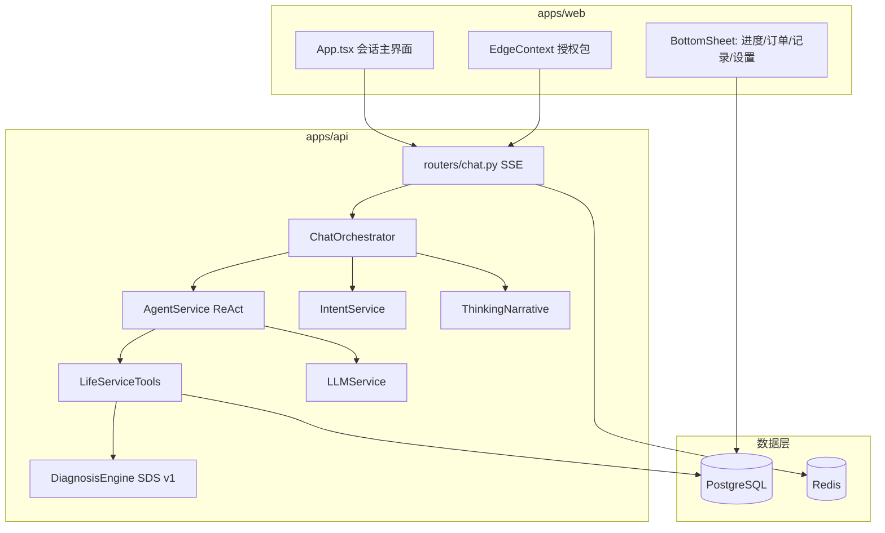
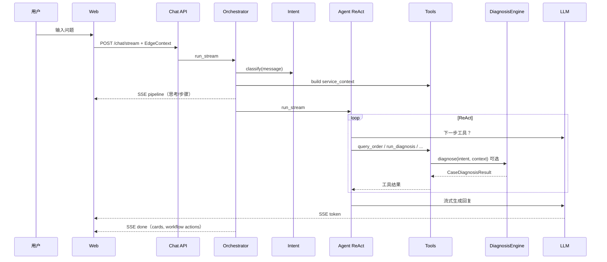

# 系统架构详解

本文描述「AI 履约服务管家」Demo 的技术分层、关键设计与数据流，便于本地开发、评审与扩展。

---

## 1. 设计目标

| 目标 | 实现方式 |
|------|----------|
| 帮用户**完成履约**，不是陪聊 | 会话 + 工具办理 + 诊断结论必须可执行 |
| 诊断有**推理过程**，不是读标签 | SDS 诊断树读 DB 事实 + 规则推导 Case |
| Demo 数据**长期可玩** | 相对时间 seed + 启动时 `mock_time_shift` |
| 对用户**透明但不露馅** | 思考区中文化；Case/Intent 仅在后端与 Prompt |

---

## 2. 总体架构



### 2.1 仓库结构

```text
apps/web/                 React + Vite + Tailwind，手机壳会话体验
apps/api/app/
  routers/                HTTP/SSE 入口（chat, life_service, diagnosis）
  services/
    orchestrator.py       流式编排、pipeline 事件
    agent.py              ReAct 循环、工具选择
    tools.py              业务 Tool 实现
    thinking_narrative.py 思考文案中文化
    usage_rules.py        从 usage_rule 文案推导时段/预约约束
    store_facts.py        POI/POS 等门店事实 helper
    llm.py / intent.py    模型与意图
  diagnosis/              SDS v1：registry, engine, matrices, case_specs
  db/
    migrate.py            启动迁移
    bulk_bootstrap.py     mock 数据幂等重灌（version 检测）
    mock_time_shift.py    启动时业务时间对齐「现在」
    knowledge_bootstrap.py 平台知识库同步
deploy/init-db/           Postgres 初始化 SQL
scripts/
  generate_mock_data.py   mock 生成器（仅客观事实）
  shift_mock_timestamps.py 手动时间对齐 CLI
```

---

## 3. 一次对话的完整路径



### 3.1 EdgeContext（端侧上下文）

前端 `buildEdgeContext` 打包：

- 隐私授权开关（订单/券/位置等）
- 当前 `user_id`、**焦点订单** `focus_order_id`
- 行为摘要（可选）

Orchestrator 据此决定可见数据范围与默认查单对象。

### 3.2 意图门控

`IntentService` 输出 `intent` + `confidence`：

- **≥ 阈值**（默认 0.65）→ 路由到业务意图，进入 Agent 工具链
- **低于阈值** → `clarify`，主 LLM 先澄清需求
- **`chitchat`** → 短闲聊并引导回履约话题

关键词兜底可在无 API Key 时保证 Demo 可跑；生产建议 `LLM_REQUIRE_LIVE=true`。

### 3.3 ReAct Agent

`AgentService.run_stream` 在多轮中：

1. 检索知识库（`knowledge_articles` 关键词）
2. 按 `tool_catalog` 意图→工具映射调用 `LifeServiceTools`
3. 将工具 JSON 结果写入会话轨迹
4. 必要时调用 `DiagnosisEngine` 得到 Case + 推荐动作
5. 组装 Prompt（含 Case 块、禁止编造规则）→ LLM 流式回复

**原则**：业务结论来自 Tool + 诊断树，不是 Prompt 硬编码。

### 3.4 思考区 narrating

`thinking_narrative.py` 把内部步骤映射为用户可读中文，例如：

- 工具名 → 「正在帮您查询门店营业信息」
- 意图 → 「您可能是想咨询核销问题」（不输出 `VoucherUnavailable`）

前端 `lib/thinking.ts` 另有 `sanitizeThinkingLine` 兜底过滤漏网英文术语。

---

## 4. SDS v1 诊断系统

### 4.1 链路

```text
Intent → 组装 DiagnosisContext → 诊断树逐步校验 → Case ID → 动作矩阵 → 注入 Prompt
```

代码入口：`apps/api/app/diagnosis/engine.py`

### 4.2 Case 体系

- **73** 个注册 Case：IC / PC / FC / AC / CC + 系统 Case
- `registry.py` + `case_specs.py`：名称、问题空间、升级等级、规则列表
- `matrices.py`：Case → 推荐 Tool 动作（如重新生成核销码、联系商家）

### 4.3 诊断输入（DiagnosisContext）

| 字段 | 来源 |
|------|------|
| `order` | `query_order`：状态、store_id、can_refund、metadata（预约记录等） |
| `voucher` | `query_voucher`：status、valid_to、**usage_rule**、store_id |
| `store` | `query_store`：营业时间、supports_reservation、metadata（POI/POS） |
| `message` | 用户原话（拒核销、跨店等现场类高度依赖） |

### 4.4 推理示例（无 seed 捷径）

| 现象 | 读取的事实 | 推理 |
|------|-----------|------|
| PC-008 跨店 | `order.store_id ≠ voucher.store_id` | 门店不匹配 |
| PC-009 时段 | `usage_rule`「仅限周末」+ **当前星期** | 规则引擎 `voucher_allowed_at` |
| FC-001 闭店 | `store.metadata.business_status = suspended` | POI 状态 |
| FC-008 扫码 | `pos_last_sync_at` 超过 6h + 用户说「扫不出来」 | 遥测 + 话术 |
| FC-006 拒核销 | 券/单均有效 | **用户描述**「老板不给用」 |

`_meta()` 将 JSONB `metadata` 与实体顶层字段合并，供诊断树读取**嵌套事实**（如 `appointment`、`pos_last_sync_at`）。

### 4.5 Storybook

`storybook.py` 为**口语→Case 期望**的测试映射，**不写入数据库**。批测脚本：`apps/api/scripts/batch_storybook_test.py`。

---

## 5. 前端架构

### 5.1 信息架构

- **主屏**：会话 + 订单焦点卡片 + 思考流 + 快捷话术
- **+ 菜单** → BottomSheet：
  - 服务进度（`fulfillment-timeline`）
  - 历史订单 / 订单详情
  - 操作记录（`service-records`，含退款金额/到账）
  - 授权设置
- **DemoUserSwitcher**：120 用户切换

### 5.2 关键组件

| 组件 | 职责 |
|------|------|
| `PhoneShell` | 手机壳 + **实时状态栏时钟** |
| `ThinkingStream` | 思考行流式展示 |
| `ServicePanels` | 进度时间线、操作记录 |
| `OrderFocusPanel` | 当前焦点订单摘要 |
| `ActionSheet` | 诊断后「您可以这样继续」 |

### 5.3 与后端协作

- `api/client.ts`：`streamChat` 消费 SSE（`thinking` / `token` / `pipeline` / `done`）
- 焦点订单持久化：`lib/orderFocus.ts`（localStorage）

---

## 6. 数据模型

| 表 | 说明 |
|----|------|
| `users` | C 端用户画像 |
| `merchant_stores` | 门店 POI + metadata（营业状态、POS 同步、搬迁旧址、当日营业公告） |
| `life_orders` | 订单 + metadata（预约确认、seed 锚点） |
| `vouchers` | 团购券；**usage_rule 为平台规则文案** |
| `coupons` | 平台优惠券 |
| `refund_cases` | 退款/售后记录 |
| `fulfillment_events` | 履约事件时间线 |
| `agent_operation_logs` | **会话产生**的操作记录（seed 不预填） |
| `knowledge_articles` | 平台知识库（退款/券/规则政策） |
| `conversation_events` | 对话与工具调用日志 |
| `service_tickets` | 转人工工单 |

---

## 7. Mock 数据机制

### 7.1 生成

`scripts/generate_mock_data.py` → `deploy/init-db/03-bulk-seed.sql`

- **120 单**：80 正常 + 9 售后 + 40 异常
- 时间相对 `SEED_ANCHOR`（2026-01-15）写入
- `order_001.metadata.seed_time_anchor` 标记锚点
- **禁止**诊断捷径字段（见 README）

### 7.2 启动时 bootstrap

`apps/api/app/main.py` lifespan → `migrate.apply_migrations`：

1. Schema patch
2. `ensure_knowledge_seed`
3. `ensure_bulk_seed`：若 `bulk_seed_version < 5` 或用户不足 → truncate `user_*` 并重灌 SQL
4. **`shift_mock_timestamps`**：`delta = now - anchor`，更新全部业务时间 + metadata 内 ISO 字段

### 7.3 版本检测

`life_orders.order_001.metadata.bulk_seed_version` 当前为 **5**。

升级后若页面数据异常，可：

```powershell
docker compose restart api
# 或彻底重置
docker compose down -v && docker compose up --build -d
```

---

## 8. 部署拓扑

Docker Compose 四服务：

| 服务 | 端口 | 说明 |
|------|------|------|
| `web` | 5173→80 | Nginx 静态资源 + `/api` 反代 |
| `api` | 8000 | FastAPI |
| `postgres` | 5432 | 领域数据；`/seed` 挂载 init-db |
| `redis` | 6379 | 会话 |

生产叠加 `docker-compose.prod.yml`，见 [DEPLOY_ALIYUN.md](./DEPLOY_ALIYUN.md)。

---

## 9. 扩展方向

- 接入真实生活服务订单/券/售后 Open API
- pgvector 语义检索知识库
- 工单坐席端、OpenTelemetry 可观测
- 门店适用列表独立表（跨店推理更完整）
