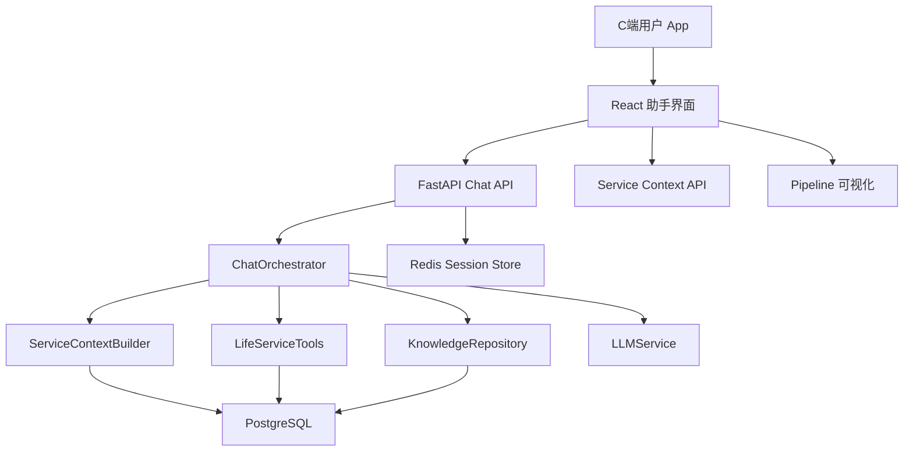
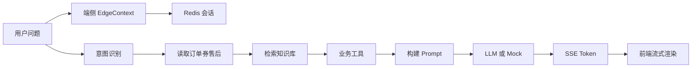

# 系统架构

## 目标

构建面向抖音生活服务 C 端用户的智能服务助手，覆盖订单、券、优惠券、退款、门店履约和人工工单。

## 架构图

## 模块说明

### 前端 `apps/web`

- `App.tsx`：产品主流程，组合对话、服务卡片、链路、设置。
- `components/PhoneShell.tsx`：移动端手机壳。
- `components/ServiceCards.tsx`：订单、券、优惠券、售后卡片。
- `components/PipelinePanel.tsx`：端侧、云端、工具、模型链路。
- `components/PrivacySettings.tsx`：端侧授权开关。
- `api/client.ts`：SSE 对话、服务上下文、退款 API。

### 后端 `apps/api`

- `services/orchestrator.py`：意图识别、上下文合并、工具调用、LLM 编排。
- `services/context.py`：读取用户服务上下文。
- `services/tools.py`：订单查询、券查询、优惠券解释、退款规则、转人工。
- `services/llm.py`：OpenAI 兼容流式调用与 Mock 模型。
- `repositories/life_service.py`：PostgreSQL 数据访问。

## 数据模型

| 表 | 说明 |
|----|------|
| `users` | C 端用户画像 |
| `merchant_stores` | 商户门店 |
| `life_orders` | 生活服务订单 |
| `vouchers` | 团购券/套餐券 |
| `coupons` | 平台优惠券 |
| `refund_cases` | 退款/售后 |
| `knowledge_articles` | 服务知识库 |
| `service_tickets` | 转人工/售后工单 |
| `conversation_events` | 对话与工具调用日志 |

## 一次对话数据流

## 部署

Docker Compose 服务：

- `postgres`：领域数据。
- `redis`：会话与消息缓存。
- `api`：FastAPI。
- `web`：Nginx 静态前端，代理 API。

## 后续扩展

- pgvector + embedding 做真实 RAG。
- 接入真实抖音生活服务订单/券/售后 API。
- 用户登录、设备绑定与 API 鉴权。
- 工单后台和客服坐席端。
- OpenTelemetry、Prometheus、日志审计。
