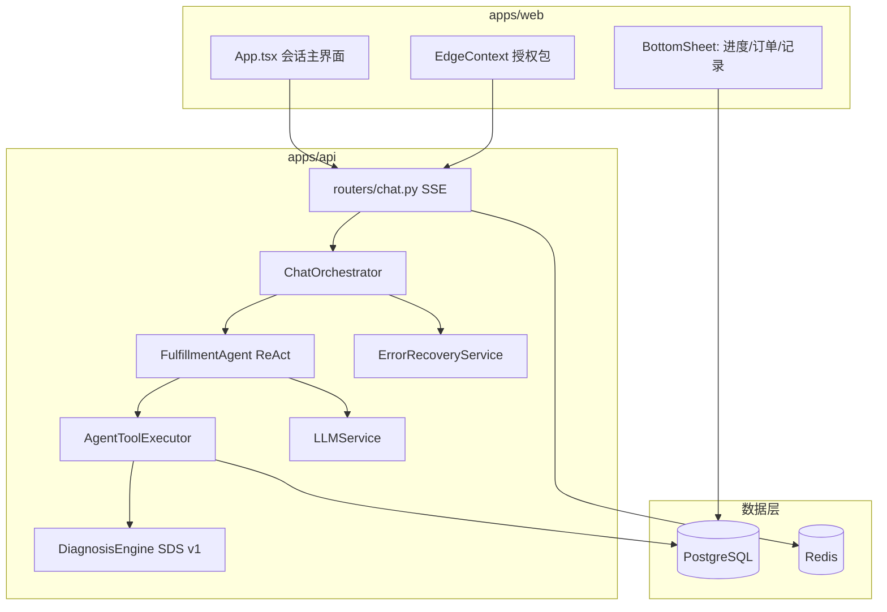
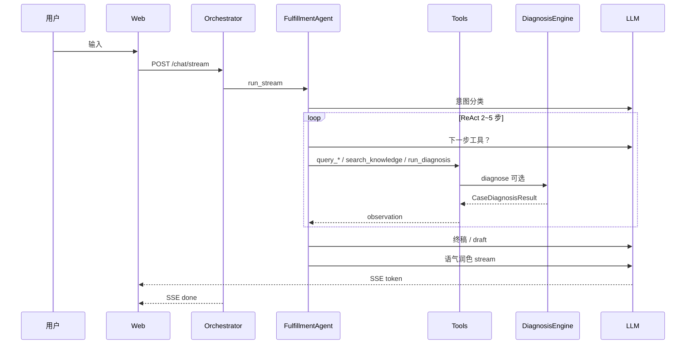

# 系统架构详解

AI 履约服务管家的技术分层、关键设计与数据流。

---

## 1. 设计目标

| 目标 | 实现 |
|------|------|
| 帮用户**完成履约** | 会话 + 工具办理 + 可执行建议 |
| 诊断可解释 | SDS 诊断树读 DB 事实 + 规则推导 Case |
| Demo 长期可玩 | 相对时间 seed + 启动 mock 时间对齐 |
| 体验专业友好 | 思考区中文化；内部 Case/Intent 不暴露给用户 |

---

## 2. 总体架构



### 2.1 仓库结构

```text
apps/web/                 React + Vite + Tailwind
apps/api/app/
  routers/chat.py         SSE 对话入口
  services/
    orchestrator.py       会话 I/O、pipeline 事件
    fulfillment_agent.py  ReAct 主循环
    agent_tools.py        工具执行器
    error_recovery.py     异常兜底（LLM + 结构化线索）
    tools.py              领域查询/写操作
    usage_rules.py        券规则/营业时段解析
    reply_polisher.py     终稿语气润色
    thinking_narrative.py 思考文案中文化
  diagnosis/              SDS v1：registry, engine, matrices
  db/
    bulk_bootstrap.py     mock 幂等重灌（version 检测）
    mock_time_shift.py    业务时间对齐
deploy/init-db/           Postgres 初始化 SQL
scripts/generate_mock_data.py
```

---

## 3. 一次对话的完整路径



### 3.1 EdgeContext

前端打包：隐私授权、`user_id`、焦点订单 `focus_order_id`、行为摘要。Orchestrator 据此拉取 service-context 并默认查单对象。

### 3.2 意图门控

关键词优先 + 轻量 LLM；置信度低于阈值走 `clarify`；`chitchat` 短回复并引导回履约话题。

### 3.3 ReAct 智能体

`FulfillmentAgent` 在多轮中：

1. 按需调用 **`search_knowledge`**（query、limit 由模型决定）
2. 调用 `query_order` / `query_voucher` / `query_store` 等读工具
3. 可选 **`run_diagnosis`** 获取结构化 Case 参考
4. `finish` 产出 draft → 语气润色 → SSE 流式输出

业务结论来自 **Tool observation + 诊断树**，智能体综合裁决是否采纳 Case。

### 3.4 异常处理

| 层级 | 行为 |
|------|------|
| 工具异常 | 返回结构化 `clues`，ReAct 继续推理 |
| 主链路崩溃 | `ErrorRecoveryService` 将上下文交给 LLM 生成可读回复 |

不向用户暴露 Python 堆栈或内部术语。

### 3.5 思考区

`thinking_narrative.py` 将工具名、步骤映射为中文叙述；前端 `sanitizeThinkingLine` 兜底过滤漏网术语。

---

## 4. SDS v1 诊断系统

```text
Intent → DiagnosisContext → 诊断树逐步校验 → Case → 动作矩阵 → 供 Agent 参考
```

- **73** 注册 Case（IC / PC / FC / AC / CC）
- 输入：订单、券、门店、用户原话
- 输出：步骤、Case ID、推荐动作（不直接写用户回复）

### 推理示例

| Case | 依据事实 |
|------|----------|
| PC-008 跨店 | `order.store_id ≠ voucher.store_id` |
| PC-009 时段 | `usage_rule` + 当前星期/时刻 |
| PC-010 缺预约 | 规则须预约 + 订单无 `reservation_confirmed` |
| FC-001 闭店 | `business_status = suspended` |
| FC-006 拒核销 | 券有效 + 用户描述「老板不给用」 |

---

## 5. 前端架构

- **主屏**：会话 + 焦点订单 + 思考流 + 快捷话术
- **+ 半屏**：履约时间线、历史订单、操作记录、授权
- **DemoUserSwitcher**：120 用户
- **SSE**：`thinking` / `token` / `pipeline` / `done`

---

## 6. 数据模型

| 表 | 说明 |
|----|------|
| `users` | C 端用户 |
| `merchant_stores` | 门店 POI、`supports_reservation`、metadata |
| `life_orders` | 订单 + metadata（预约记录等） |
| `vouchers` | 团购券 + **usage_rule 文案** |
| `coupons` | 平台优惠券 |
| `refund_cases` | 退款/售后 |
| `fulfillment_events` | 履约事件时间线 |
| `knowledge_articles` | 平台知识库 |
| `conversation_events` | 对话与工具日志 |

库中**无**诊断 Case 标签；仅客观业务事实。

---

## 7. Mock 数据机制

### 生成

`scripts/generate_mock_data.py` → `deploy/init-db/03-bulk-seed.sql`

- 120 用户：80 正常 + 40 异常
- 门店预约策略：约一半 `must_reserve`、一半 `walk_in`
- 时间相对 `SEED_ANCHOR` 写入

### 启动 bootstrap

1. Schema migrate  
2. 知识库 seed  
3. **`ensure_bulk_seed`**：版本 `< 6` 时 truncate mock 用户数据并重灌  
4. **`shift_mock_timestamps`**：对齐到当前时刻  

当前版本：**bulk_seed_version = 6**

---

## 8. 部署拓扑

| 服务 | 端口 | 说明 |
|------|------|------|
| `web` | 5173→80 | Nginx + API 反代 |
| `api` | 8000 | FastAPI |
| `postgres` | 5432 | 领域数据 |
| `redis` | 6379 | 会话 |

详见 [DEPLOY_ALIYUN.md](./DEPLOY_ALIYUN.md)。

---

## 9. 扩展方向

- 真实生活服务 Open API 对接  
- 向量检索知识库  
- 工单坐席端、OpenTelemetry  
- 门店适用列表独立表  
